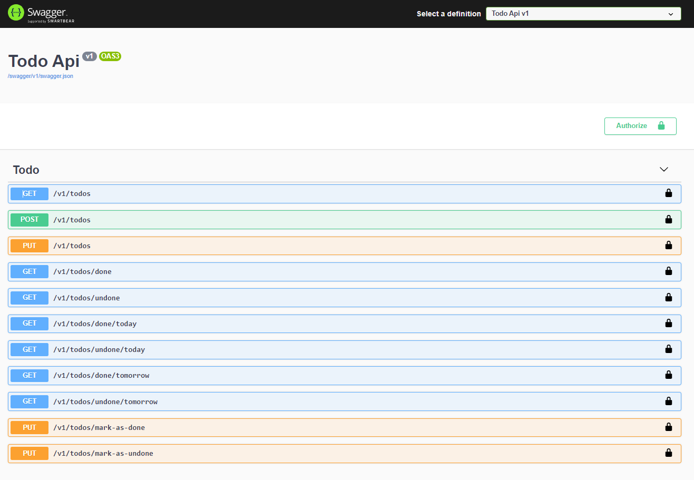

# ASP.NET Core, Angular, Flutter, TODO

## Back-end (ASP.NET Core)

    

## Front-end (Angular)

    

## Mobile (Flutter)

### EF Core Migrations

-   Install: dotnet tool install --global dotnet-ef
-   Create: dotnet ef migrations add "migration-name" --startup-project ../Todo.Domain.Api/
-   Update: dotnet ef database update --startup-project ../Todo.Domain.Api/
